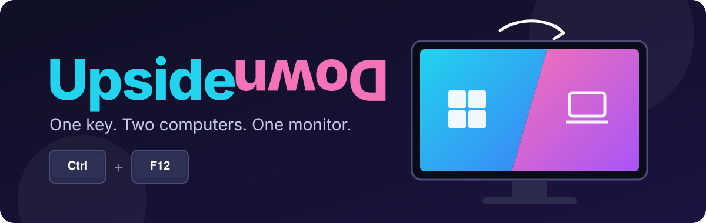
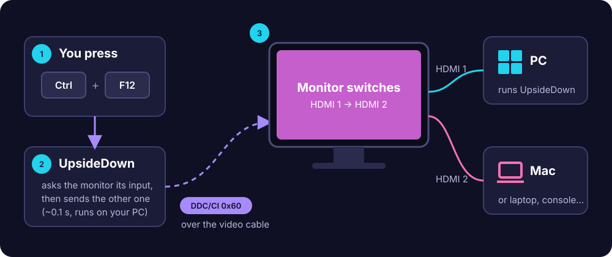
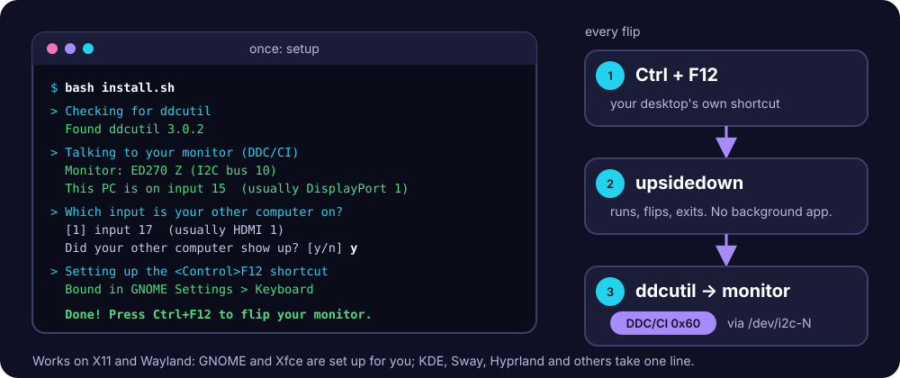

<p align="center">
  
</p>

<p align="center">
  <b>Flip your monitor over to your other computer with one hotkey.</b><br>
  PC ⇄ Mac, laptop or console. No KVM switch. No reaching for the monitor's buttons. No extra hardware.<br>
  <sub>(It switches the monitor's <i>input</i>. Your screen doesn't actually turn upside down.)</sub>
</p>

<p align="center">
  <a href="#one-click-setup"></a>
  <a href="#linux-setup"></a>
  <a href="https://www.autohotkey.com"></a>
  <a href="https://www.ddcutil.com"></a>
  <a href="LICENSE"></a>
</p>

---

## Why

You have one great monitor and two computers plugged into it. Switching means fumbling
for the tiny joystick behind the screen and clicking through menus, every single time.

UpsideDown turns that into **Ctrl + F12**.

## How it works

<p align="center">
  
</p>

Almost every monitor made in the last 15 years understands **DDC/CI**, a small control
channel that runs over the same HDMI or DisplayPort cable as the picture. It's how
brightness apps talk to your screen. One of its commands, `0x60`, means *"switch input"*.

On Windows, UpsideDown is a tiny [AutoHotkey](https://www.autohotkey.com) script that sends that
command straight through Windows. On Linux, it's a small shell script that sends it with
[ddcutil](https://www.ddcutil.com). Either way it asks the monitor which input it's on and
flips to the other one.

- **Fast:** the command goes out in about 0.1 s.
- **Tiny:** one script, no drivers, no background service, no network.
- **Reliable:** retries when the monitor drops a message, and re-sends if a switch doesn't stick.

## One-click setup

> [!NOTE]
> These steps are for Windows. On Linux, see [Linux setup](#linux-setup).

1. **Download** this repo: green **Code** button → **Download ZIP**, then unzip it anywhere.
2. **Double-click `install.bat`.**
3. Answer one question: when the screen flips to your other computer, type **y**.

That's it. Press **Ctrl + F12** to flip.

> [!TIP]
> Turn your other computer on and keep it awake before running setup, so you can see it
> when the installer test-flips to it.

### What the installer does

| Step | What happens |
| --- | --- |
| 1. AutoHotkey | Installs [AutoHotkey v2](https://www.autohotkey.com) with `winget` if you don't have it. |
| 2. Detect | Reads which input your PC is on and which inputs your monitor has. |
| 3. Test-flip | Switches to each candidate input for 8 seconds and back, until you confirm the right one. |
| 4. Install | Copies UpsideDown to `%LOCALAPPDATA%\UpsideDown` and saves your settings. |
| 5. Autostart | Adds a shortcut to your Startup folder so UpsideDown runs every time you sign in. |
| 6. Run | Starts UpsideDown right away. Look for the green **H** icon in the system tray. |

Nothing needs admin rights, and nothing is changed outside your user folder.

### Advanced options

Run the installer from a terminal to skip the questions:

```powershell
.\install.ps1 -Other 18 -NoTest        # you already know the other input code
.\install.ps1 -Hotkey "^!m"            # use Ctrl+Alt+M instead of Ctrl+F12
.\install.ps1 -ThisPC 15 -Other 17     # set both inputs yourself
```

## Linux setup

<p align="center">
  
</p>

Works on X11 and Wayland, on any distro with `ddcutil` (Arch, Debian/Ubuntu, Fedora, openSUSE,
Void, Gentoo...).

```sh
git clone https://github.com/root-luffy/UpsideDown.git   # or download the ZIP and unzip it
cd UpsideDown
bash install.sh
```

Answer the same question as on Windows: when the screen flips to your other computer, type **y**.
Then press **Ctrl + F12** to flip.

### What the Linux installer does

| Step | What happens |
| --- | --- |
| 1. ddcutil | Installs [ddcutil](https://www.ddcutil.com) with your package manager if you don't have it (asks for `sudo`). |
| 2. I2C access | Only if needed: loads the `i2c-dev` kernel module and adds a udev rule so your user can talk to the monitor (asks for `sudo`). |
| 3. Detect | Finds your monitor, reads which input your PC is on and which inputs the monitor has. If you have several monitors, it asks which one. |
| 4. Test-flip | Switches to each candidate input for 8 seconds and back, until you confirm the right one. |
| 5. Install | Copies the `upsidedown` command to `~/.local/bin` and saves settings to `~/.config/upsidedown/config.ini`. |
| 6. Shortcut | Binds **Ctrl + F12** in GNOME or Xfce. On other desktops it prints the command to bind yourself. |

Linux apps can't grab global hotkeys on Wayland, so UpsideDown uses your desktop's own keyboard
shortcuts instead. That also means nothing runs in the background.

Advanced options:

```sh
bash install.sh --other 18 --no-test          # you already know the other input code
bash install.sh --hotkey "<Control><Alt>m"    # use Ctrl+Alt+M instead of Ctrl+F12
bash install.sh --this-pc 15 --other 17       # set both inputs yourself
bash install.sh --bus 6                       # pick the monitor by I2C bus (see: ddcutil detect)
```

### Other desktops

Add a keyboard shortcut that runs `~/.local/bin/upsidedown flip`:

| Desktop | How |
| --- | --- |
| KDE Plasma | *System Settings → Keyboard → Shortcuts → Add New → Command or Script* |
| Sway / i3 | `bindsym Ctrl+F12 exec ~/.local/bin/upsidedown flip` |
| Hyprland | `bind = CTRL, F12, exec, ~/.local/bin/upsidedown flip` |
| Cinnamon / MATE / others | Keyboard settings → custom shortcut |

### The `upsidedown` command

| Command | What it does |
| --- | --- |
| `upsidedown` | Flip to the other computer, and back again. |
| `upsidedown to 17` | Switch to a specific input code. |
| `upsidedown status` | Show your settings and the monitor's current input. |
| `upsidedown config` | Open the settings file in your editor. |

## Using it

| Do this | To |
| --- | --- |
| **Ctrl + F12** | Flip the monitor to the other computer, and back again. |
| Double-click the tray icon | Flip, with the mouse. |
| Right-click the tray icon → **Edit settings** | Change the hotkey or input codes. |
| Right-click the tray icon → **Reload** | Apply your changes. |

On Linux there's no tray icon. Use the shortcut, the **UpsideDown** entry in your app menu, or the
[`upsidedown` command](#the-upsidedown-command).

The keyboard and mouse stay connected to your PC, so **Ctrl + F12 works in both directions**,
even while the monitor is showing the other computer.

## Settings

On Windows, everything lives in `%LOCALAPPDATA%\UpsideDown\config.ini`:

```ini
[UpsideDown]
ThisPC=15      ; input code of the PC running UpsideDown
Other=18       ; input code of your other computer
Hotkey=^F12    ; ^ Ctrl   ! Alt   + Shift   # Win
```

On Linux, it's `~/.config/upsidedown/config.ini`. It has `ThisPC` and `Other` too, plus `Bus`
(the monitor's I2C bus) and `Monitor` (its maker, model and serial). Linux can renumber I2C buses
after a driver or kernel update; when that happens, UpsideDown finds the monitor again by `Monitor`
and updates `Bus` itself. Changes apply the next time you press the hotkey. To change the hotkey
itself, use your desktop's keyboard settings or run `install.sh` again.

### Input codes

These are the standard codes. **Manufacturers don't always follow them**. On some Acer
models, for example, HDMI 2 reports `15`. That's why the installer test-flips instead
of guessing.

| Input | Standard code |
| --- | --- |
| VGA 1 / 2 | 1 / 2 |
| DVI 1 / 2 | 3 / 4 |
| DisplayPort 1 / 2 | 15 / 16 |
| HDMI 1 / 2 | 17 / 18 |
| USB-C | 27 |

## Troubleshooting

<details>
<summary><b>"Your monitor didn't answer"</b></summary>

Turn on **DDC/CI** in your monitor's on-screen menu. It's usually under *System*, *Setup*
or *Other*. Some monitors ship with it off.
</details>

<details>
<summary><b>It flips to a black "No signal" screen, then lands on the right computer a few seconds later</b></summary>

The input code is one off. The monitor is switching to an empty input and then auto-scanning
until it finds your other computer. Run `install.bat` (or `install.sh`) again and pick a different input, or
edit `Other=` in the settings.
</details>

<details>
<summary><b>The switch feels slow</b></summary>

UpsideDown sends the command in about 0.1 s. The rest is the monitor locking onto the new
signal, which usually takes 1 to 3 seconds. You can shorten it:

- Turn off **Auto Source / Input Auto-Detect** in the monitor menu.
- Run both computers at the same resolution and refresh rate, so the monitor doesn't have to
  change its picture timing on every switch. Turning off HDR also helps.
- Stop the other computer from sleeping its display (on a Mac: System Settings → Lock Screen).
- DisplayPort usually switches faster than HDMI, because HDMI repeats a copy-protection
  handshake every time.
</details>

<details>
<summary><b>Sometimes it takes two presses</b></summary>

Some monitors ignore commands while they're busy switching. Wait until the picture
settles before pressing again. UpsideDown also re-checks 2.5 s after each flip and
re-sends if the monitor didn't follow.
</details>

<details>
<summary><b>I have more than one monitor</b></summary>

On Windows, UpsideDown controls your **primary** display. Set the monitor you want to flip as the
main display in *Settings → System → Display*.

On Linux, the installer asks which monitor to use. To change it later, set `Bus=` in the settings
to a bus number from `ddcutil detect`.
</details>

<details>
<summary><b>Linux: "No monitor answered"</b></summary>

Run `ddcutil detect` and check what it says:

- **Turn on DDC/CI** in the monitor's on-screen menu.
- **Permission denied on `/dev/i2c-*`**: run `install.sh` again so it can add the udev rule, or
  log out and back in.
- **NVIDIA proprietary driver**: DDC can be flaky. See ddcutil's
  [NVIDIA notes](https://www.ddcutil.com/nvidia/).
- **Laptop's built-in screen**: that's normal. Internal panels don't speak DDC/CI; only external
  monitors do.
</details>

<details>
<summary><b>Linux: nothing happens when I press the shortcut</b></summary>

Run `upsidedown` in a terminal to see any error. If that works, the shortcut isn't bound: check
your desktop's keyboard settings, or make sure another app isn't already using **Ctrl + F12**.
</details>

<details>
<summary><b>Can I flip back from the Mac's keyboard?</b></summary>

UpsideDown runs on Windows and Linux. On a Mac, [m1ddc](https://github.com/waydabber/m1ddc) (Apple
Silicon) or [BetterDisplay](https://github.com/waydabber/BetterDisplay) can send the
same command, for example `m1ddc set input 15`.
</details>

## Uninstall

**Windows:** double-click **`uninstall.bat`**. It stops UpsideDown and removes the startup shortcut and
`%LOCALAPPDATA%\UpsideDown`. AutoHotkey stays installed; remove it from *Settings → Apps*
if you don't need it.

**Linux:** run `bash uninstall.sh`. It removes the command, settings, app menu entry and the
GNOME/Xfce shortcut. ddcutil stays installed.

## Project layout

```
UpsideDown/
├── install.bat          one-click installer (runs install.ps1)
├── install.ps1          detects inputs, test-flips, installs
├── uninstall.bat        one-click uninstaller
├── uninstall.ps1
├── install.sh           Linux installer
├── uninstall.sh         Linux uninstaller
├── src/
│   ├── upsidedown.ahk   the Windows switcher (~100 lines)
│   ├── upsidedown.sh    the Linux switcher (uses ddcutil)
│   └── config.ini       default settings (Windows)
└── assets/              README illustrations (banner, how it works, Linux setup)
```

## Contributing

Bug reports and pull requests are welcome. If UpsideDown doesn't work with your monitor,
please open an issue with the monitor model, your OS, and what the installer printed
(on Linux, the output of `ddcutil detect` helps too).

## License

[MIT](LICENSE). Use it, change it, share it.
